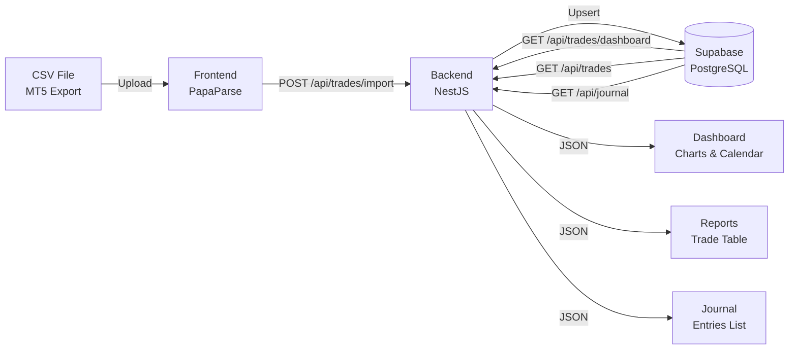

# 📈 AntiGrav — Project Overview

A full-stack terminal-style trading application with a modern "anti-gravity" Material Design aesthetic. The app enables traders to import trade data from CSV exports (e.g. MetaTrader 5), visualize performance through interactive charts and calendars, and maintain a personal journal of daily reflections.

---

## 🏗️ Architecture

```
trading-journal/
├── backend/          ← NestJS REST API (TypeScript)
├── frontend/         ← React SPA via Vite (TypeScript)
├── Fonts/            ← Custom fonts (Exo 2, Oleo Script)
├── Logo.png          ← App branding logo
├── plan.md           ← Development plan
└── .gitignore
```

The frontend communicates with the backend over a REST API. Authentication is handled via **JWT tokens** sent in the `Authorization` header of every protected request.

---

## 🧰 Tech Stack

### Frontend
| Technology | Purpose |
|---|---|
| **React 19** + **TypeScript** | Core UI framework |
| **Vite 7** | Dev server & build tool |
| **MUI (Material UI) 7** | Component library & design system |
| **Emotion** | CSS-in-JS styling engine for MUI |
| **Framer Motion 12** | Physics-based animations & micro-interactions |
| **Recharts 3** | Interactive line charts (Cumulative PnL) |
| **PapaParse 5** | Client-side CSV parsing |
| **React Router DOM 7** | Client-side routing |
| **date-fns 4** | Date manipulation & formatting |
| **Lucide React** | Additional modern icons |

### Backend
| Technology | Purpose |
|---|---|
| **NestJS 11** | Server framework (modular, decorator-based) |
| **Prisma 5** | ORM for PostgreSQL |
| **Supabase (PostgreSQL)** | Cloud-hosted database |
| **@nestjs/jwt** + **Passport** | JWT-based authentication |
| **bcryptjs** | Password hashing |
| **pg** | PostgreSQL driver |
| **TypeScript** | Type-safe backend |

---

## 🔐 Authentication

- **Strategy**: JWT (JSON Web Tokens) via Passport + `@nestjs/jwt`
- **Password Security**: bcrypt hashing with salt rounds (10)
- **Default Demo User**: Auto-seeded on server start via `onModuleInit`
  - Email: `ankitkhedar12@gmail.com`
  - Password: `Test@123`
- **Token Storage**: JWT + user email stored in `localStorage`
- **Protected Routes**: All `/api/trades` and `/api/journal` endpoints require a valid JWT in the `Authorization: Bearer <token>` header
- **Frontend Guards**: `<ProtectedRoute>` component redirects unauthenticated users to `/login`

### Auth API

| Method | Endpoint | Description |
|---|---|---|
| `POST` | `/api/auth/login` | Authenticate & receive JWT |

---

## 📊 Dashboard (Home Page)

The central hub of the application, featuring three main sections:

### 1. Cumulative PnL Chart
- **Interactive line chart** (Recharts) showing cumulative profit/loss over time
- Animated data points that drift into place (Framer Motion)
- Custom tooltip with glassmorphism styling
- Prominent total PnL badge with color coding (green = profit, red = loss)
- Pulsing animation on the total PnL figure

### 2. Monthly Calendar
- **Interactive trading calendar** with navigable months (prev/next)
- Each day is color-coded:
  - **Green** → net positive PnL for that day
  - **Red** → net negative PnL for that day
  - **Neutral** → no trades on that day
- **Hover tooltips** showing exact PnL amount and trade count per day
- Floating summary bubble with smooth entry/exit animations

### 3. Quick Stats Panel
- **Total Trades** count
- **Win Rate** percentage
- **Largest Loss** amount
- Each stat displayed in a styled card with accent-colored left borders

---

## 📥 Import Data

- **CSV Upload** via click-to-select file dialog
- Supports both **UTF-8** and **UTF-16 LE** encoded files (handles MetaTrader 5 exports)
- **Auto-detects delimiter** (tab vs comma) from the first 5 lines
- **Fuzzy header matching** — handles trailing whitespace, invisible characters in column names
- **Mapped Fields**: Symbol, Volume, Entry Price, Close Price, PnL, Net PnL, Charges/Swap, Open Time, Close Time, Order ID, Status
- **Duplicate prevention** via `orderId` upsert on the backend
- **Processing indicator** with spinner and status text
- Auto-redirects to Reports page on successful import

### Trades API

| Method | Endpoint | Description |
|---|---|---|
| `POST` | `/api/trades/import` | Bulk import parsed trade data (upsert by orderId) |
| `GET` | `/api/trades` | Fetch all trades (ordered by `openedAt` desc) |
| `GET` | `/api/trades/dashboard` | Get cumulative chart data + quick stats |

---

## 📓 Journal (Daily Reflections)

- **Create journal entries** with:
  - Subject / Theme (e.g., "Stick to the plan")
  - Date picker (defaults to today)
  - Free-form text area for reflections
- **Recent Entries** list with:
  - Avatar showing the day number
  - Subject, date, and full text
  - Tag chips (Win/Loss/Custom) with color coding
- User-scoped entries (each user sees only their own)

### Journal API

| Method | Endpoint | Description |
|---|---|---|
| `POST` | `/api/journal` | Create a new journal entry (auth-scoped) |
| `GET` | `/api/journal` | Fetch all entries for the logged-in user |

---

## 📋 Reports (Trade History)

- **Full trade list** displayed in a styled data table
- Columns: Symbol, Volume (Lots), Entry → Close Price, PnL, Date
- Each row is **color-coded**:
  - Green background + left border for profitable trades
  - Red background + left border for losing trades
- **Staggered entry animations** (Framer Motion)
- Empty state with prompt to import data

---

## ⚙️ Settings

### Appearance Controls
- **Theme Mode Toggle**: Switch between Light and Dark mode (persisted in `localStorage`)
- **Liquid Glass Style**: Choose between:
  - **Tinted (Frosted)** — semi-opaque glassmorphism
  - **Clear (Transparent)** — fully transparent glass

---

## 🎨 Design System & UI/UX

### Theme
- **Dual themes**: Light (`#f8fafc` background) and Dark (`#0f172a` background)
- **Color Palette**:
  - Primary: Google Blue (`#2196f3`)
  - Success: Green (`#4caf50`) — profit indicators
  - Error: Red (`#f44336`) — loss indicators
- **Typography**: `Exo 2` (body) + `Oleo Script` (decorative headings)
- **Shape**: 16px default border radius

### Glassmorphism
- Semi-transparent paper backgrounds with `backdrop-filter: blur(10px)`
- Liquid Glass effect via SVG displacement map filters
- Configurable via Settings (tinted vs clear)

### Animations (Framer Motion)
- **FloatingCard**: Slide-up + fade-in on mount, subtle scale on hover
- **Chart dots**: Staggered scale-in animation
- **Calendar tiles**: Lift on hover with floating tooltip
- **Navigation dock**: Spring-based "water drop" active indicator that morphs between tabs
- **Login logo**: Gentle bobbing/floating animation
- **Page transitions**: Slide + fade animations

### Navigation
- **Floating dock** (macOS-inspired) — centered at top on desktop, bottom on mobile
- Liquid glass container with spring-animated active pill
- Responsive: icon-only on mobile, icon + label on desktop
- Settings button separated on mobile for space efficiency
- **Top-right controls**: Theme toggle + user avatar with dropdown menu (email display + logout)

---

## 🗄️ Database Schema (Prisma + PostgreSQL)

### `User`
| Field | Type | Notes |
|---|---|---|
| `id` | UUID | Primary key, auto-generated |
| `email` | String | Unique |
| `password` | String | bcrypt hashed |
| `createdAt` | DateTime | Auto-set |
| `updatedAt` | DateTime | Auto-updated |
| `entries` | JournalEntry[] | Relation |

### `Trade`
| Field | Type | Notes |
|---|---|---|
| `id` | UUID | Primary key |
| `symbol` | String | e.g. "EURUSD" |
| `volume` | String | e.g. "0.05/0.05" |
| `entryPrice` | Float | |
| `closePrice` | Float | |
| `pnl` | Float | Gross PnL |
| `netPnl` | Float | Net PnL (after charges) |
| `chargesSwap` | String | e.g. "0.00/0.00" |
| `openedAt` | DateTime | Trade open timestamp |
| `closedAt` | DateTime | Trade close timestamp |
| `orderId` | String | Unique (dedup key) |
| `status` | String | e.g. "Closed" |

### `JournalEntry`
| Field | Type | Notes |
|---|---|---|
| `id` | UUID | Primary key |
| `date` | DateTime | Entry date |
| `subject` | String | Theme/title |
| `text` | String | Full reflection text |
| `tags` | String[] | Array of tag labels |
| `userId` | String | FK → User.id |

---

## 📂 Detailed File Structure

### Backend (`/backend`)
```
src/
├── main.ts                    # App bootstrap, CORS config, port binding
├── app.module.ts              # Root module (imports Auth, Journal, Trades)
├── prisma.service.ts          # Prisma client wrapper
├── auth/
│   ├── auth.module.ts         # Auth module (JWT config)
│   ├── auth.controller.ts     # POST /api/auth/login
│   ├── auth.service.ts        # Login logic, demo user seeding
│   ├── jwt.strategy.ts        # Passport JWT strategy
│   └── jwt-auth.guard.ts      # Route guard
├── trades/
│   ├── trades.module.ts       # Trades module
│   ├── trades.controller.ts   # GET /api/trades, POST /api/trades/import, GET /api/trades/dashboard
│   └── trades.service.ts      # Import (upsert), stats computation, date parsing
├── journal/
│   ├── journal.module.ts      # Journal module
│   ├── journal.controller.ts  # GET & POST /api/journal
│   └── journal.service.ts     # Create & list entries (user-scoped)
prisma/
└── schema.prisma              # Database models (User, Trade, JournalEntry)
```

### Frontend (`/frontend`)
```
src/
├── main.tsx                   # App entry (AuthProvider + ThemeProvider)
├── App.tsx                    # Routes (BrowserRouter)
├── theme.ts                   # MUI light/dark theme definitions
├── index.css                  # Global CSS (grid background, glass effects)
├── App.css                    # App-level styles
├── components/
│   ├── Layout.tsx             # Main layout (nav dock, top bar, logo, SVG filters)
│   └── ProtectedRoute.tsx     # Auth-guarded route wrapper
├── context/
│   ├── AuthContext.tsx         # Auth state (login, logout, token management)
│   └── ThemeContext.tsx        # Theme state (light/dark, glass mode)
├── pages/
│   ├── Login.tsx              # Login page (animated, branded)
│   ├── Dashboard.tsx          # PnL chart + calendar + quick stats
│   ├── Journal.tsx            # Create & view journal entries
│   ├── Reports.tsx            # Trade history table
│   ├── ImportData.tsx         # CSV upload & parsing
│   └── Settings.tsx           # Theme & glass mode settings
└── utils/
    └── config.ts              # API base URL configuration
```

---

## 🚀 Running the Project

### Backend
```bash
cd backend
npm install
npx prisma generate        # Generate Prisma client
npx prisma db push         # Push schema to Supabase DB
npm run start              # Start NestJS server (port 3000)
```

### Frontend
```bash
cd frontend
npm install
npm run dev                # Start Vite dev server (port 5173)
```

### Environment Variables (Backend `.env`)
| Variable | Description |
|---|---|
| `DATABASE_URL` | Supabase pooled connection string |
| `DIRECT_URL` | Supabase direct connection string |
| `JWT_SECRET` | Secret key for signing JWTs |

---

## 🔄 Data Flow


